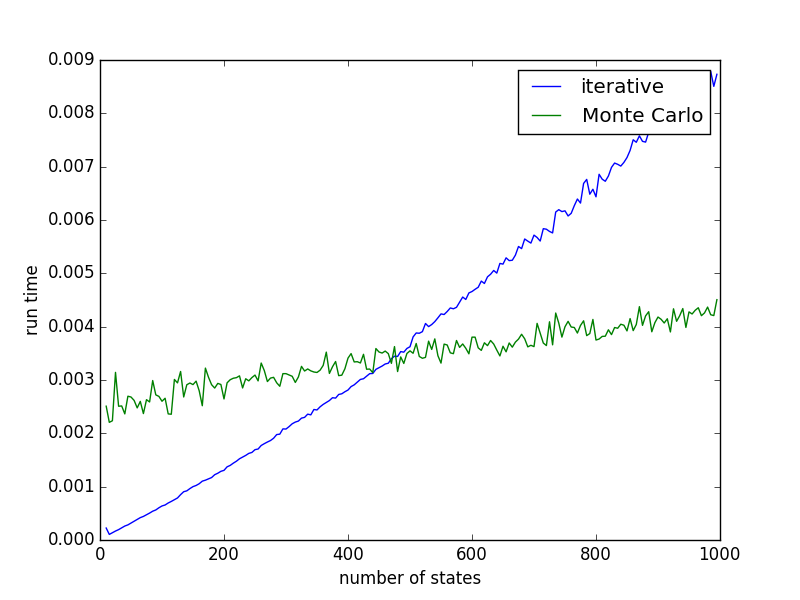

The aim of this assigment is:

1. Present the Monte Carlo method described in paper 
<a href='https://papers.nips.cc/paper/865-monte-carlo-matrix-inversion-and-reinforcement-learning'> Monte Carlo Matrix Inversion and Reinforcement Learning
</a>

2. Prove the complexity of this method using Curtiss' CLT argument that might be found in
<a href='http://www.cs.fsu.edu/~mascagni/Curtiss_1954_Symposium_Monte_Carlo.pdf'>this paper</a>

3. Give a better estimate of the complexity using concentration inequalities.

4. Implement the iterative method and the Monte Carlo method and compare experimentally their complexities.

